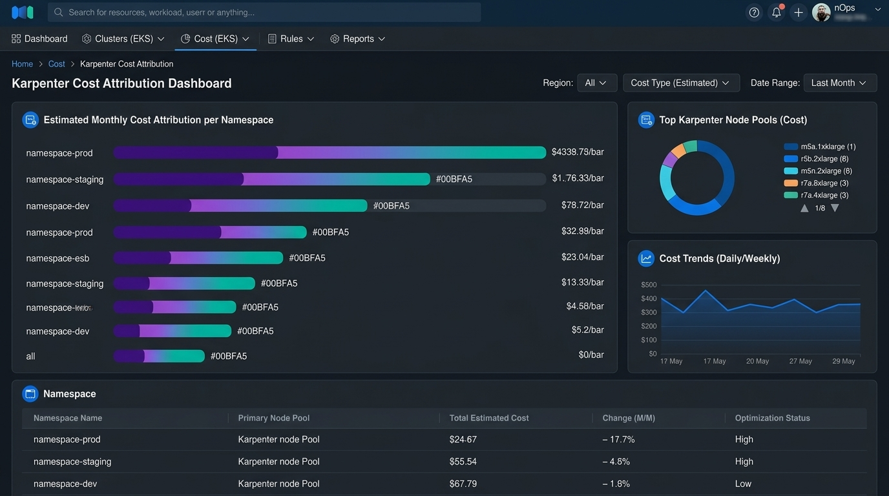

# Karpenter / EKS Cost Attribution CLI

Attributes EC2 spend driven by Karpenter-provisioned nodes back to
Kubernetes namespace/label, so platform teams can see which workloads are
actually driving node cost — not just aggregate EC2 spend.

## Why

Karpenter provisions nodes dynamically based on pod scheduling pressure.
Cost Explorer sees "EC2 spend"; it has no idea which namespace or team
triggered that provisioning. This tool joins cost-allocation-tagged EC2
instances (tagged by Karpenter with `karpenter.sh/nodepool`, etc.) against
live `kubectl` node/pod state to build a per-namespace cost breakdown.

## Features

- Reads current node → pod → namespace mapping via the Kubernetes API
- Pulls per-instance on-demand/spot pricing from Cost Explorer or the
  Pricing API
- Allocates each node's cost across the namespaces of pods scheduled on it
  (proportional to requested CPU/memory)
- Outputs a per-namespace chart (markdown table and matplotlib PNG chart)

### Dashboard Preview



## Quickstart

```bash
pip install -e .
# requires a valid kubeconfig context pointed at the target EKS cluster,
# and AWS credentials with ce:GetCostAndUsage + pricing:GetProducts
karpenter-cost-attribution report --namespace-filter "team-*"
```

## Architecture

```
src/karpenter_cost_attribution/
├── k8s_client.py     # node/pod/namespace discovery via kubernetes client
├── pricing.py        # per-instance-type cost lookup (Pricing API)
├── attribution.py     # proportional cost allocation logic
├── report.py          # markdown table rendering
└── cli.py             # entrypoint (argparse)
```

## Roadmap

- [ ] Historical attribution (not just live cluster snapshot) via
      CloudWatch Container Insights
- [ ] Spot interruption cost impact as a separate line item
- [ ] Export to Cost Explorer cost allocation tags for native reporting

## License

MIT — see [LICENSE](LICENSE).
